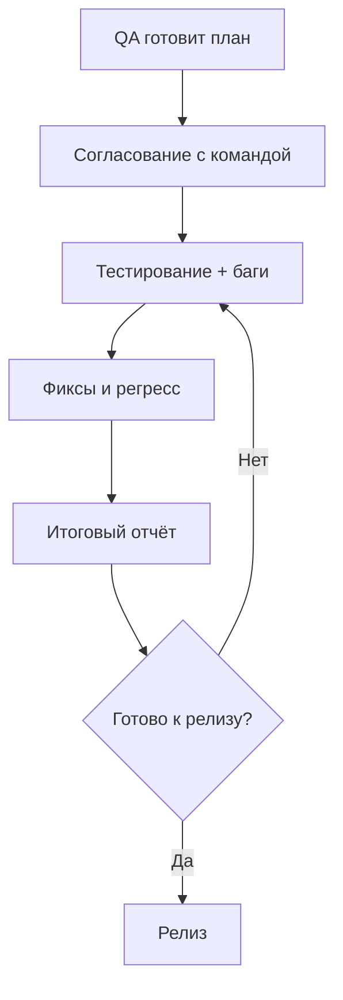

# QA Documentation.

> Единое пространство для тест-стратегии, регламентов и отчётов.  
> Структура соответствует логике IEEE 829 / ISO/IEC/IEEE 29119-3.

---

## Структура артефактов
| Файл | Назначение | Когда используется | Кто заполняет |
|------|------------|---------------------|---------------|
| [`TEST_PLAN.md`](TEST_PLAN.md) | Стратегия, scope, критерии входа/выхода, расписание, риски | До начала тестирования | QA Lead / QA Engineer |
| [`CONTRIBUTING.md`](CONTRIBUTING.md) | Правила оформления багов, матрица Severity/Priority, workflow задач | Постоянно (справочник) | Вся команда |
| [`TEST_SUMMARY_REPORT.md`](TEST_SUMMARY_REPORT.md) | Итоговые метрики, статус дефектов, рекомендация к релизу | После завершения цикла тестов | QA Engineer / QA Lead |
| `README.md` | Этот файл. Навигация и описание процесса | — | — |

---

## Как это работает в реальном процессе

### Планирование
- QA создаёт `TEST_PLAN.md`, подставляет данные проекта, отмечает `[In Scope]` / `[Out of Scope]`.
- Документ отправляется на согласование команде (чат / почта / митинг).
- После утверждения план считается **базовой линией** для спринта/релиза.

### Тестирование
- При обнаружении дефекта создаётся запись в трекере строго по шаблону из `CONTRIBUTING.md`.
- Разработчик фиксирует баг → переводит статус в `Ready for QA` → QA проверяет на тестовом окружении.
- По мере выполнения QA обновляет чек-листы `[ ]` → `[x]` в `TEST_PLAN.md`.

### Завершение
- Все критерии выхода соблюдены → QA заполняет `TEST_SUMMARY_REPORT.md` реальными метриками.
- Формируется вердикт: `✅ К релизу` / `🔴 Не рекомендовано`.
- Собирается финальное согласование → план и отчёт сохраняются в репозитории.

---

## Почему так сделано? (Рационализация)

| Традиционный подход | Структурированный подход | Выгода |
|---------------------|--------------------------|--------|
| Один файл на 15+ страниц | Разделение на 3 логических документа | ✅ Удобнее читать, проще находить нужное, легче обновлять |
| План и отчёт в одном документе | План = стратегия, Отчёт = факты | ✅ Нет путаницы между "что планировали" и "что получили" |
| Баги оформляются "как удобнее" | Единый шаблон + матрица критичности | ✅ Меньше возвратов от Dev, быстрее триаж, прозрачные приоритеты |
| Валидация "на глаз" | Чек-листы и явные критерии | ✅ Все понимают, когда документ готов, а когда — нет |

> **IEEE 829 в современном контексте:** Стандарт описывает *логическую структуру*, а не инструмент. Файлы можно вести в Markdown, Word, Confluence — главное, чтобы информация была полной и актуальной.

---

## Быстрый старт
1. **Подготовка плана:** Скопируйте [`TEST_PLAN.md`](TEST_PLAN.md) → замените все `[...]` на данные вашего проекта → отправьте на согласование команде.
2. **Оформление дефектов:** При нахождении бага создавайте запись в трекере — используйте шаблон из [`CONTRIBUTING.md`](CONTRIBUTING.md) для единообразия.
3. **Подведение итогов:** По завершении спринта/релиза заполните [`TEST_SUMMARY_REPORT.md`](TEST_SUMMARY_REPORT.md) фактическими метриками и сформируйте вердикт.
4. **Контроль качества:** Перед финальным сохранением проверьте, что все плейсхолдеры `[...]` заменены, а чек-листы `[ ]` обновлены на `[x]`.

---

## Workflow тестирования

---

## Полезные ссылки
- [Тест-план](TEST_PLAN.md)
- [Правила оформления багов](CONTRIBUTING.md)
- [Итоговый отчёт](TEST_SUMMARY_REPORT.md)

---
Документация поддерживается QA-командой. При изменениях процесса обновляйте этот README.md и согласовывайте с командой.