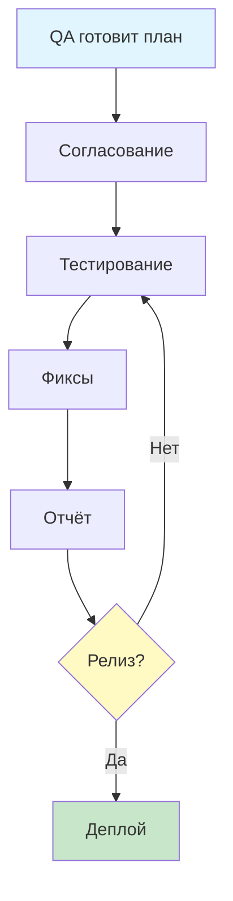

# QA Documentation: [Документация]

> Единое пространство для тест-стратегии, регламентов и отчётов.  
> Структура соответствует логике IEEE 829 / ISO/IEC/IEEE 29119-3, адаптированной под Git/DevOps.

---

## Структура артефактов
| Файл | Назначение | Когда используется | Кто заполняет |
|------|------------|---------------------|---------------|
| [`TEST_PLAN.md`](TEST_PLAN.md) | Стратегия, scope, критерии входа/выхода, расписание, риски | До начала тестирования | QA Lead / QA Engineer |
| [`CONTRIBUTING.md`](CONTRIBUTING.md) | Правила оформления багов, матрица Severity/Priority, workflow задач | Постоянно (справочник) | Вся команда |
| [`TEST_SUMMARY_REPORT.md`](TEST_SUMMARY_REPORT.md) | Итоговые метрики, статус дефектов, рекомендация к релизу | После завершения цикла тестов | QA Engineer / QA Lead |
| `README.md` | Этот файл. Навигация и описание процесса | — | — |

---

## Как это работает в реальном процессе

### Планирование
- QA создаёт `TEST_PLAN.md`, подставляет данные проекта, отмечает `[In Scope]` / `[Out of Scope]`.
- Открывается Pull Request → GitHub Actions проверяет отсутствие пустых `[...]` и `TODO`.
- После апрува PO/Dev Lead план считается **базовой линией** для спринта/релиза.

### Тестирование
- При обнаружении дефекта создаётся Issue строго по шаблону из `CONTRIBUTING.md`.
- Разработчик фиксирует баг → переводит в `Ready for QA` → QA проверяет на staging.
- По мере выполнения QA обновляет чек-листы `[ ]` → `[x]` в `TEST_PLAN.md`.

### Завершение
- Все критерии выхода соблюдены → QA заполняет `TEST_SUMMARY_REPORT.md` реальными метриками из Jira/TestRail.
- Формируется вердикт: `✅ К релизу` / `🔴 Не рекомендовано`.
- Собирается финальный sign-off → план и отчёт архивируются в релизной ветке/теге.

---

## Почему так сделано? (Рационализация)

| Традиционный подход | Git/DevOps-подход | Выгода |
|---------------------|-------------------|--------|
| Один PDF/Word на 15+ страниц | Разделение на 3 Markdown-файла | ✅ Удобное diff-ревью, контроль версий, параллельная работа |
| План и отчёт в одном документе | План = стратегия, Отчёт = факты | ✅ Нет путаницы между "что планировали" и "что получили" |
| Баги оформляются "как удобнее" | Единый шаблон + матрица критичности | ✅ Меньше возвратов от Dev, быстрее триаж, прозрачные приоритеты |
| Валидация "на глаз" | GitHub Actions + markdownlint | ✅ CI блокирует мерж с пустыми полями, битыми ссылками или незаполненными чек-листами |

> **IEEE 829 в современном контексте:** Стандарт описывает *логическую структуру*, а не формат хранения.
  В DevOps артефакты разбивают по файлам для CI/CD-интеграции, ревью через PR и автоматической генерации метрик.

---

## Быстрый старт
1. Скопируйте [`TEST_PLAN.md`](TEST_PLAN.md) → заполните плейсхолдеры → отправьте PR.
2. При баге используйте шаблон из [`CONTRIBUTING.md`](CONTRIBUTING.md) (автоматически подтянется в GitHub Issues).
3. По итогу спринта заполните [`TEST_SUMMARY_REPORT.md`](TEST_SUMMARY_REPORT.md) реальными цифрами.
4. GitHub Actions автоматически проверит файлы. Если что-то не заполнено → мерж заблокируется.

---

## Workflow тестирования

---

## 🔗 Полезные ссылки
- [Тест-план](TEST_PLAN.md)
- [Правила оформления багов](CONTRIBUTING.md)
- [Итоговый отчёт](TEST_SUMMARY_REPORT.md)

---
*Документация поддерживается QA-командой. При изменениях процесса обновляйте этот файл.*